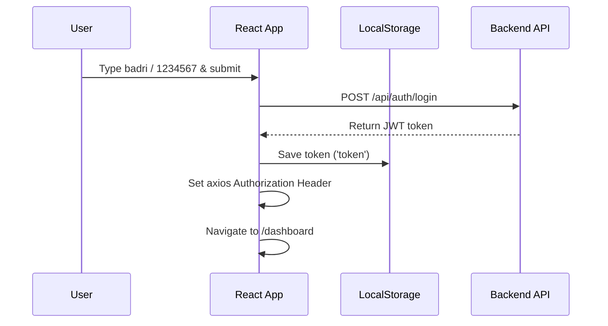
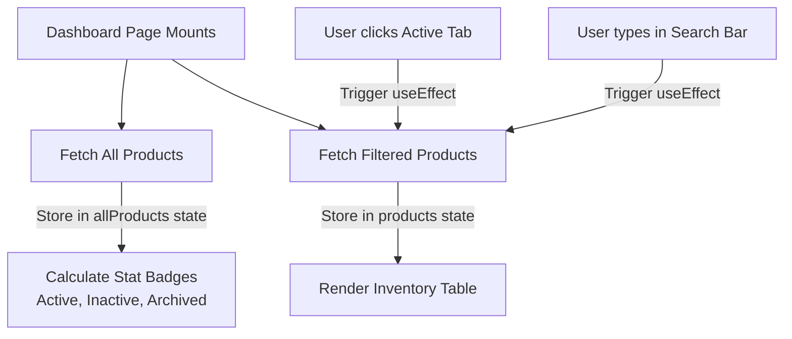
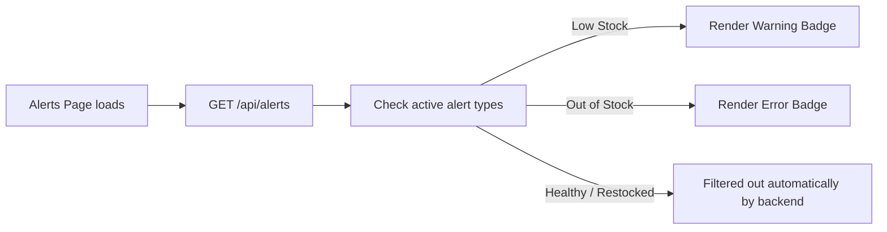
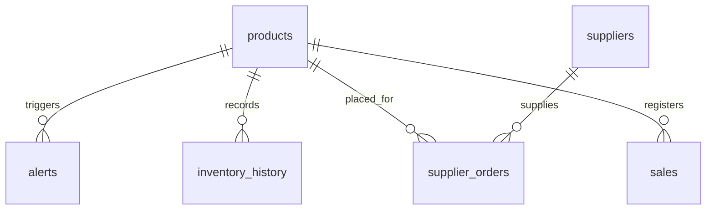
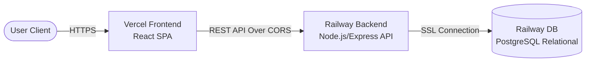

# 🖥️ Quiklee — Full-Stack Architecture, Testing & Cloud Deployment
### College Project Presentation (Master Slide/Report)

---

## 🏗️ Frontend Overview

The frontend of **Quiklee** is a single-page application (SPA) built with a focus on real-time interactivity, sleek design, and responsive layouts suitable for dark store managers.

### 🛠️ Technology Stack
*   **Core Library:** React 18
*   **Build Tool:** Vite (fast development server & optimized builds)
*   **UI / Design System:** Material UI (MUI) v5
*   **Routing:** React Router DOM v6
*   **HTTP Client:** Axios (with request & response interceptors)
*   **Hosting:** Vercel

---

## 📂 Frontend File Structure

```
frontend/src/
├── App.jsx              ← Root component: handles login view & layout shell
├── main.jsx             ← Entry point: renders the app into HTML DOM
├── routes/
│   └── AppRoutes.jsx    ← Maps URL paths to React components
├── services/
│   └── api.js             ← Axios configuration and HTTP request helpers
├── components/
│   ├── Navbar.jsx         ← Top action bar (logout, profile, dashboard status)
│   ├── Sidebar.jsx        ← Navigation panel (Dashboard, Alerts, Suppliers, Reports)
│   ├── LoadingSpinner.jsx ← Full screen/card layout loader
│   └── EmptyState.jsx     ← Displayed when lists or search queries return empty
└── pages/
    ├── InventoryDashboard.jsx ← Product list with status filtering & statistics
    ├── Alerts.jsx             ← Low stock, out of stock, and expiry logs
    ├── InventoryForm.jsx      ← Shared form for adding and editing products
    ├── Reports.jsx            ← Data visualization for inventory trends
    └── Suppliers.jsx          ← Supplier contact registry
```

---

## 🔄 Core Frontend Flows

### 1. User Authentication Flow (JWT)



> 💡 **Axios Interceptor Security:** If any API request fails with a `401 Unauthorized` response (e.g. if the token expires), a response interceptor automatically clears local storage and routes the user back to the login page.

---

### 2. Live Dashboard Filtering & Stats Flow

The Dashboard utilizes two distinct React states to maintain correct stats while filtering tables:



*   **Stat Badges:** Always reflect overall warehouse health using `allProducts`.
*   **Inventory Table:** Interactively updates table rows to match selected tab and search strings without resetting the overall count metrics.

---

### 3. Self-Healing Alert Logs

The Alerts page listens to stock updates to dynamically present active warnings.



*   **Metric Box (Healthy SKUs):** Computes how many products are running safely by evaluating:
    $$\text{Healthy SKUs} = \text{Products where } (\text{stock\_level} > \text{reorder\_level})$$

---

## 🎨 Design System & User Experience

*   **Sleek Dark Mode:** Dark-themed backgrounds (`#121212`) combined with glowing typography and border alerts prevent visual fatigue for store operators.
*   **Micro-Animations:** Interactive rows and stateful hover cues highlight product selection.
*   **Responsiveness:** Designed on standard MUI Grid layouts, shifting gracefully from tablet displays to widescreen monitors.

---

## 🗄️ Database Architecture & Relational Design

The database of **Quiklee** serves as the single source of truth for stock counts, alert generation, and transaction logs. It utilizes a highly normalized schema designed for relational integrity and query speed.

### 🛠️ Database Stack & Features
*   **DBMS Engine:** PostgreSQL (production scaling on Railway) & SQLite (local development adapter scaffolding).
*   **Connection Pooling:** Structured using `pg` Pool helper to manage multiple concurrent client requests safely.
*   **SQL Injection Protection:** Fully parameterized queries (`$1`, `$2` bindings) implemented across all CRUD operations.
*   **Compatibility Adapter Wrapper:** Custom implementation of `pool.execute()` to map MySQL `?` placeholders dynamically to PostgreSQL parameters.

---

## 📂 Database Schema (Tables & Constraints)

The database schema consists of several core tables to represent the dark store data model:



### Table Schema Details:
1.  **products:** `id` (PK), `product_name`, `sku` (Unique), `category`, `store_name`, `stock_level`, `picked_quantity`, `reorder_level`, `status`, `expiry_date`, `created_at`, `updated_at`.
2.  **alerts:** `id` (PK), `product_id` (FK), `alert_type` (Low Stock / Out of Stock), `message`, `created_at`.
3.  **inventory_history:** `id` (PK), `product_id` (FK), `old_stock`, `new_stock`, `updated_at`.
4.  **suppliers:** `id` (PK), `name`, `contact_info`, `email`, `created_at`.
5.  **supplier_orders:** `id` (PK), `supplier_id` (FK), `product_id` (FK), `quantity`, `status` (pending/received), `order_date`.
6.  **sales:** `id` (PK), `product_id` (FK), `quantity`, `total_price`, `sale_date`.

---

## 🔍 DB Initialization & Seeding Script

When the backend server boots up, an automatic self-healing migration and seeding pipeline checks and creates the tables, then seeds it with starting records.

### 📂 Seeding Strategy (scripts/seed_15_records.js)
*   **Users Table:** Inserts default admin (`badri` / `1234567`) and staff (`staff` / `staff`) accounts.
*   **Suppliers Table:** Registers suppliers like *Global Foods Inc.* and *Local Farm Organics*.
*   **Products Table:** Seeds 15 high-volume SKU items (such as *Organic Rice*, *Almond Milk*, and *Chocolate Chip Cookies*) with varied stock counts to demonstrate Dashboard alerts.
*   **Sales History:** Aggregates random transaction data over the past 5 days to populate report graphs.

---

## 🧪 Comprehensive Testing Strategy

To ensure zero-downtime reliability in production, Quiklee backend and frontend undergo rigorous testing covering integration endpoints and edge-case inputs.

### 🛠️ Testing Environment & Tools
*   **API Test Runner:** Jest (provides test assertions, hooks, and test execution runner).
*   **HTTP Request Assertion:** Supertest (spins up Express server in memory to perform stateless API calls).
*   **Frontend Validation:** React Testing Library + Jest for mock component rendering.
*   **Postman Collection Verification:** Manual testing scripts that test the entire REST lifecycle.

---

## 📊 Verification & Test Scenarios

The test suites verify 15 core real-world dark store scenarios:

### 15 Core Scenario Validations:
1.  **Product CRUD:** Create product, read details, update attributes, and delete item.
2.  **Stock adjustments:** Adding stock delta (+10) and subtracting picked quantity (-5) successfully.
3.  **Low stock threshold alerts:** Triggering `Low Stock` alert when quantity falls below `reorder_level`.
4.  **Out of Stock alarms:** Triggering `Out of Stock` warning when stock levels hit exactly 0.
5.  **Data sanitization:** Rejecting malformed payloads containing SQL tags or HTML scripts.
6.  **Edge cases:** Checking response format for non-existent product IDs (returns 404 cleanly).
7.  **Supplier registration:** Creating and reading supplier profiles.
8.  **Order processing:** Tracking supplier orders from pending to received status.
9.  **Reporting graphs:** Ensuring total counts & distribution ratios are calculated accurately.
10. **Stateless authentication:** Rejecting access to protected endpoints on invalid JWT signature.

---

## 🚀 Cloud Deployment Architecture

Quiklee utilizes a distributed cloud model to isolate user presentation (frontend) from backend data processing:



*   **Origin Separation:** The frontend SPA on Vercel acts as a static client, communicating asynchronously with the Railway API server.
*   **SSL Security:** Connection strings between Backend and DB utilize encrypted SSL certificates for safety.
*   **Config Separation:** Environment variables manage secrets like database URLs and JWT secret keys.

---

## 🌐 Frontend Deployment on Vercel

The React application is deployed to **Vercel** via GitHub integration, enabling automated builds on code pushes.

### ⚙️ Vercel Configurations (`vercel.json`)
```json
{
  "version": 2,
  "framework": "vite",
  "buildCommand": "npm run build",
  "outputDirectory": "dist",
  "installCommand": "npm install",
  "rewrites": [
    { "source": "/(.*)", "destination": "/index.html" }
  ]
}
```
*   **Routing Rewrites:** Redirects all browser route requests back to `index.html` to enable React Router SPA client routing.
*   **Build Optimization:** The Vite bundle compiler compiles asset chunks to the `dist/` output directory.

---

## ⚙️ Backend & Database Deployment on Railway

The Express API backend and PostgreSQL instance are hosted on **Railway**, automating Docker container containerization.

### 🐳 Nixpacks & Procfile Config
Railway reads a `railway.json` file to auto-configure build rules using **Nixpacks**:
```json
{
  "$schema": "https://railway.app/railway.schema.json",
  "build": {
    "builder": "NIXPACKS"
  },
  "deploy": {
    "startCommand": "node server.js",
    "restartPolicyType": "ON_FAILURE"
  }
}
```
*   **Procfile:** Defines the deployment task runner: `web: node server.js`.
*   **Environment Variables Setup:**
    *   `DATABASE_URL`: Connection string of PostgreSQL.
    *   `JWT_SECRET`: Security salt for user logins.
    *   `FRONTEND_URL`: CORS-allowed origin string.

---

## 🚧 Challenges & Resolutions in Production

Deploying a multi-origin fullstack web application introduces challenges that were addressed:

### 1. Cross-Origin Resource Sharing (CORS)
*   *Issue:* Vercel client calls to Railway API were blocked by browser CORS policy.
*   *Resolution:* Added Express dynamic `cors()` middleware with configurable origin headers linked to Vercel domains.

### 2. Connection Pool Errors
*   *Issue:* Exhausting available database connections during concurrent traffic peaks.
*   *Resolution:* Implemented connection pooling with a maximum limit and idle timeout parameters.

### 3. Ephemeral Railway Filesystem
*   *Issue:* Railway containers erase written files on rebuild (loss of SQLite data).
*   *Resolution:* Migrated data storage from local SQLite files to a persistent, dedicated cloud database instance.
